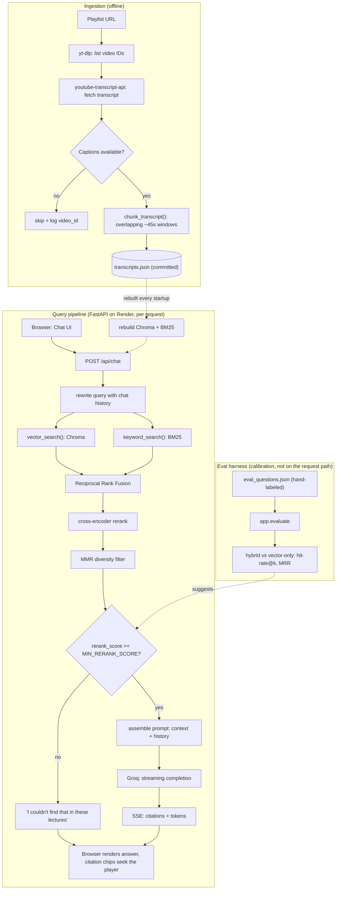

# RAG 2.0 — Architecture

## Why transcripts are rebuilt on startup

Render's free tier disk is ephemeral — wiped on every restart/redeploy. Instead of persisting
a Chroma directory, the app commits a pre-processed `transcripts.json` (chunked text +
timestamp metadata, no embeddings, no secrets) and rebuilds the Chroma + BM25 indexes from it
at container startup. Deploys stay stateless and reproducible.

## Two pipelines, one deployable backend

- **Ingestion** (`app/ingest.py`) runs offline — pulls playlist transcripts from YouTube,
  chunks them by overlapping timestamp windows, writes `transcripts.json`.
- **Query** (`app/rag.py`, `app/retrieval.py`, `app/vectorstore.py`, `app/main.py`) runs
  per-request inside the deployed FastAPI app: hybrid vector+keyword retrieval, cross-encoder
  reranking, MMR diversity filtering, a calibrated guardrail, then Groq streaming over SSE.

## Guardrail calibration

The guardrail's cutoff (`MIN_RERANK_SCORE`) isn't a number to guess — cross-encoder scores
aren't 0-centered in practice. On measured data, genuinely relevant top hits ranged -0.7 to
-8, while irrelevant questions clustered near -11. `app.evaluate` reports the real hit/miss
score gap on your own playlist and suggests a calibrated value from it.
